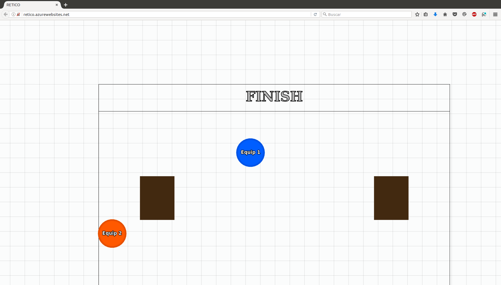

Retico: Real Time Collaborative Game
=============
[](https://travis-ci.org/ribes4/retico)

# README #



This project is based on [this template](https://github.com/huytd/node-online-game-template).

### Installation ###

#### Requirements
To run / install this game, you'll need: 
- NodeJS with NPM installed.
- socket.IO.
- Express.

#### Downloading the dependencies
After cloning the source code from Github, you need to run the following command to download all the dependencies (socket.IO, express, etc.):

```
npm install
```

#### Running the Server
After downloading all the dependencies, you can run the server with the following command:

```
npm start
```
The game will then be accessible at `http://localhost:3000` or the respective server installed on. The default port is `3000`.

### Deploying to Render ###

1. Push this repository to GitHub.
2. Go to [render.com](https://render.com) and create a new **Web Service**.
3. Connect your GitHub repository.
4. Use these settings:
   - **Runtime:** Node
   - **Build Command:** `npm install`
   - **Start Command:** `npm start`
5. Click **Create Web Service**. Render will deploy it automatically.

> **Note:** Render's free tier spins down after inactivity. The first request after sleep may take a few seconds.

### License ###

* This project is licensed under the terms of the **MIT** license.
